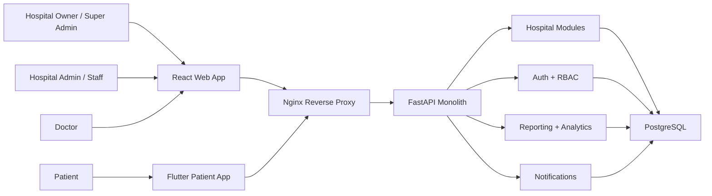
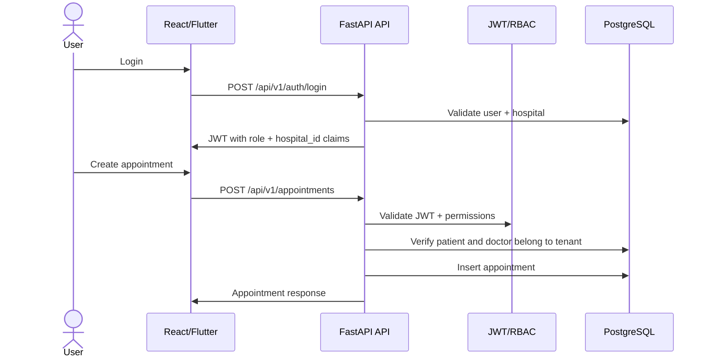
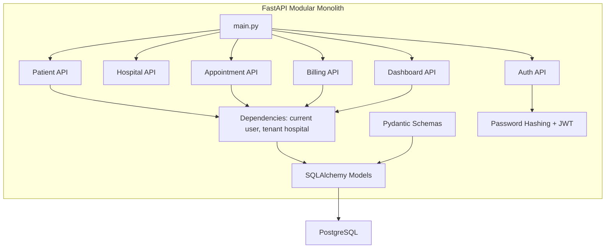
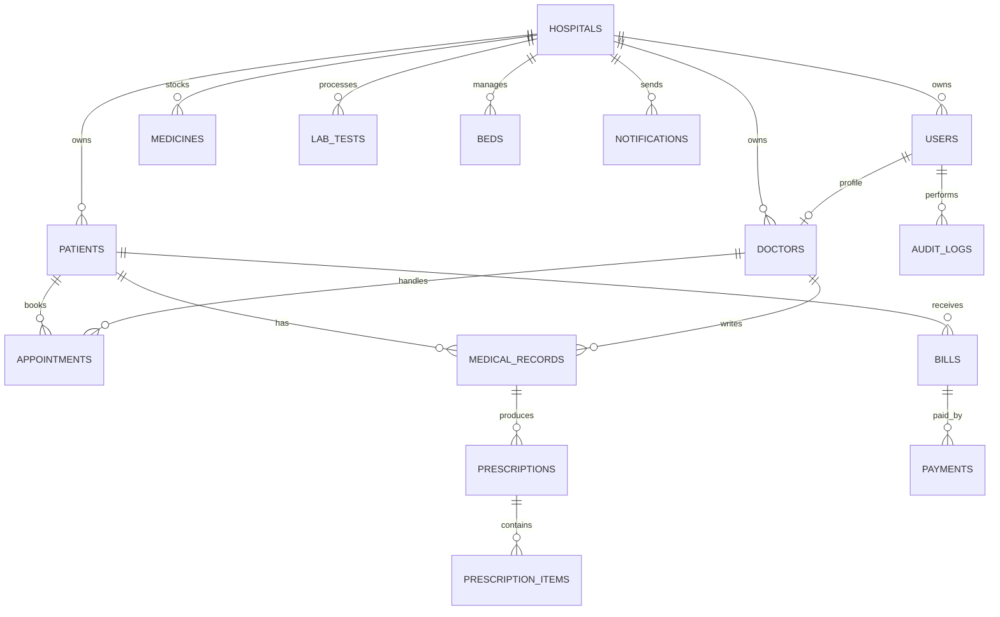
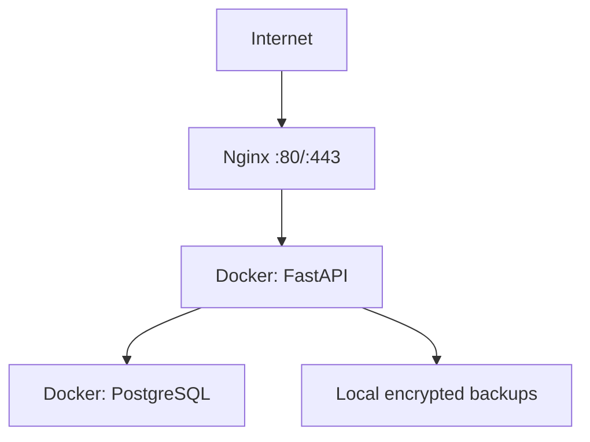
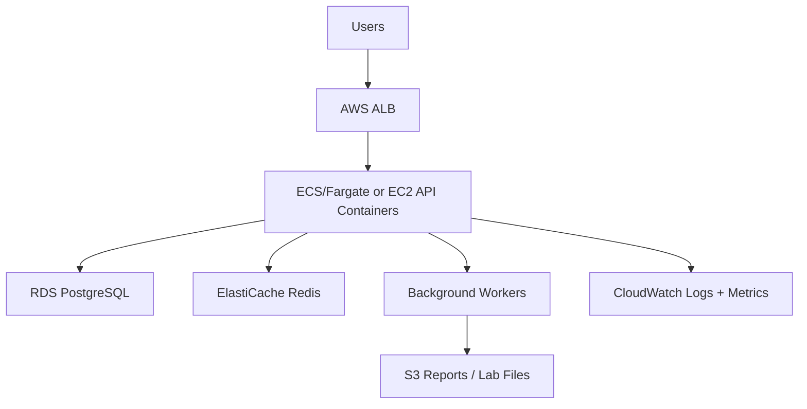
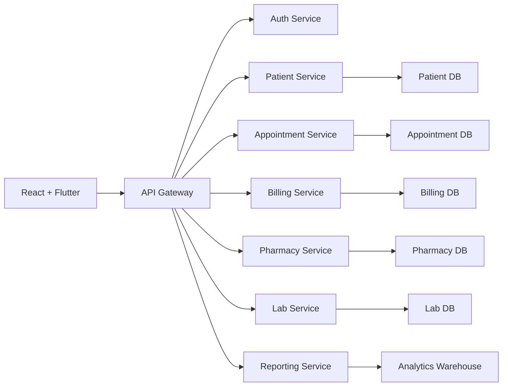

# Healthcare Management Platform MVP Architecture

This document converts the initial product inputs into an MVP-ready architecture for a Python/FastAPI platform that can later scale from a few hospitals to an enterprise multi-hospital deployment.

## 1. High-Level System Architecture

### MVP Service Interactions

- React and Flutter call versioned REST APIs under `/api/v1`.
- Nginx terminates public traffic and proxies API requests to FastAPI.
- FastAPI handles authentication, authorization, tenant scoping, business workflows, reporting queries, and notification creation.
- PostgreSQL stores all transactional records with `hospital_id` on tenant-owned tables.
- Pandas, NumPy, Plotly, and OpenPyXL are used inside reporting endpoints or background export jobs.

### MVP Data Flow

## 2. Low-Level Component Diagram

## 3. Database Architecture

### Multi-Tenant Strategy

Use a shared database, shared schema, tenant discriminator model for MVP:

- Every hospital-owned table includes `hospital_id`.
- Application dependencies resolve the active tenant from the JWT user or `X-Hospital-ID` for super admins.
- Every query must filter by `hospital_id` unless it is explicitly platform-level.
- Unique constraints should include `hospital_id` for hospital-local codes and numbers.
- Add database indexes on `hospital_id`, date fields, status fields, and high-volume lookup fields.

This gives the fastest MVP path with low operational cost. Later, enterprise tenants can be moved to schema-per-tenant or database-per-tenant if a contract requires stricter isolation.

### Entity Relationships

### Future Scalability Considerations

- Keep module boundaries clean: patient, appointment, billing, pharmacy, lab, reporting.
- Avoid direct cross-module writes from UI handlers; put workflow logic in service classes when the codebase grows.
- Introduce Alembic migrations before production data goes live.
- Add read replicas for dashboard/reporting queries.
- Partition large tables by date or hospital when table size demands it.
- Move files such as prescriptions and lab reports to object storage, storing only URLs and metadata in PostgreSQL.

## 4. API Architecture

### REST Standards

- Base path: `/api/v1`.
- Resource naming: plural nouns, for example `/patients`, `/appointments`, `/billing/bills`.
- Authentication: `Authorization: Bearer <jwt>`.
- Tenant scoping: normal users derive `hospital_id` from the authenticated user; `SUPER_ADMIN` passes `X-Hospital-ID` for tenant-scoped APIs.
- Pagination: add `limit`, `offset`, `sort`, and filter query params before production load.
- Errors: use standard HTTP codes with a stable JSON body: `detail`, `code`, and optional `fields`.

### Initial MVP Endpoints

- `POST /api/v1/auth/login`
- `GET /api/v1/auth/me`
- `GET /api/v1/hospitals`
- `POST /api/v1/hospitals`
- `GET /api/v1/patients`
- `POST /api/v1/patients`
- `GET /api/v1/appointments`
- `POST /api/v1/appointments`
- `GET /api/v1/billing/bills`
- `POST /api/v1/billing/bills`
- `GET /api/v1/dashboard/metrics`

## 5. Security Architecture

### RBAC

MVP roles:

- `SUPER_ADMIN`: cross-hospital platform operations.
- `HOSPITAL_ADMIN`: hospital-level admin.
- `DOCTOR`: appointment, patient history, prescriptions, reports.
- `RECEPTIONIST`: registration, scheduling, admission/discharge coordination.
- `LAB_TECHNICIAN`: lab bookings, sample tracking, reports.
- `PHARMACIST`: inventory, dispensing, stock alerts.
- `ACCOUNTANT`: billing, payments, insurance.
- `PATIENT`: patient portal and mobile app.

### Controls

- Hash passwords with bcrypt.
- Use short-lived JWT access tokens and add refresh tokens in the next production iteration.
- Enforce tenant filtering at the dependency/repository layer.
- Encrypt TLS traffic through Nginx or load balancer.
- Use PostgreSQL encryption at rest through managed storage or disk encryption.
- Store documents and lab reports in private object storage with signed URLs.
- Write audit logs for login, patient updates, prescription changes, billing changes, report uploads, and admin actions.
- Run daily encrypted database backups for MVP; add point-in-time recovery for production.

## 6. Deployment Architecture

### Phase 1: Single Linux Server

Use this for the first pilot:

- One Linux VM.
- Docker Compose.
- Nginx reverse proxy.
- PostgreSQL Docker volume.
- Daily backups to off-server storage.
- Uptime monitor and log rotation.

### Phase 2: AWS Managed Deployment

Add:

- RDS PostgreSQL with automated backups and point-in-time recovery.
- Redis for caching, sessions, queues, and rate limiting.
- Celery/RQ/Dramatiq workers for notifications, report exports, invoice generation, and reminders.
- S3 for lab reports, prescriptions, invoices, and attachments.
- CloudWatch/Grafana for logs, metrics, traces, and alerts.

### Phase 3: Enterprise Microservices

Add Kubernetes, service-level databases, event bus, autoscaling, centralized secrets, distributed tracing, and SLO-based alerting.

