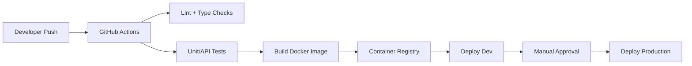

# MVP to Enterprise Roadmap, Team, CI/CD, and Cost

## Migration Strategy

### Stage 1: MVP Monolith

- One FastAPI app.
- One PostgreSQL database.
- Shared-schema multi-tenancy using `hospital_id`.
- React web app for management/staff.
- Flutter app for patients.
- Manual or simple CI/CD deployment.

Target: first pilot hospitals and validated workflows.

### Stage 2: Modular Monolith

- Split code into modules: auth, hospitals, patients, appointments, billing, pharmacy, lab, reporting, notifications.
- Add service classes and repository/query layers.
- Add Alembic migrations, automated tests, background jobs, Redis cache, and object storage.
- Add feature flags for hospital-specific configuration.

Target: 10-50 hospitals with stronger reliability.

### Stage 3: Microservices

- Extract high-change/high-load modules first: auth, patient, appointment, billing, lab, pharmacy, reporting.
- Add API gateway, event bus, service-specific databases, and asynchronous integration events.
- Move analytical workloads to a reporting warehouse.
- Run on Kubernetes with horizontal scaling.

Target: 100+ hospitals and enterprise contracts.

## MVP Development Roadmap

### Month 1: Foundation

- Finalize workflows and role matrix.
- Build FastAPI project, database schema, auth, RBAC, tenant scoping.
- Build React shell, login, navigation, dashboard.
- Build Flutter auth and patient appointment shell.

### Month 2: Core Operations

- Patient registration.
- Doctor management.
- Appointment scheduling.
- OPD billing.
- Medical records and prescriptions.
- Basic dashboard KPIs.

### Month 3: Department Modules

- Pharmacy inventory and stock alerts.
- Laboratory booking and report upload.
- Payment tracking.
- Invoice PDF/XLSX exports.
- Notifications and reminders.

### Month 4: Pilot Readiness

- Audit logs.
- Backup automation.
- Test coverage for core workflows.
- Role-specific UI cleanup.
- Deployment hardening and pilot onboarding.

## Enterprise Roadmap

- Insurance workflow.
- IPD admission/discharge and bed management.
- Teleconsultation.
- SSO and enterprise identity integration.
- HL7/FHIR integration layer.
- Data warehouse and advanced analytics.
- Multi-region disaster recovery.
- Kubernetes autoscaling and blue/green deployments.

## CI/CD Design

Minimum checks:

- Python formatting/linting.
- API tests.
- Migration check.
- Docker image build.
- Dependency vulnerability scan.
- Deployment smoke test against `/health`.

## Estimated Team Structure

### MVP Team

- 1 Product owner / business analyst.
- 1 Solution architect or senior backend lead.
- 2 Backend developers.
- 2 React frontend developers.
- 1 Flutter developer.
- 1 QA engineer.
- 1 DevOps engineer, part-time.
- 1 UI/UX designer, part-time.

### Enterprise Team

- 1 Engineering manager.
- 1 Product owner plus domain BA.
- 1 Architect.
- 4-6 Backend developers.
- 3-4 React developers.
- 2-3 Flutter developers.
- 2 QA automation engineers.
- 1-2 DevOps/SRE engineers.
- 1 Data/reporting engineer.
- 1 Security/compliance consultant, part-time.

## Cost Estimate

These are planning ranges, not vendor quotes. Validate cloud prices with the official AWS Pricing Calculator before purchase.

### MVP Build Cost

- Small internal MVP team in India: INR 18L-45L for 3-4 months.
- Lean outsourced MVP: INR 25L-60L depending on UI depth and reporting complexity.
- Initial infrastructure: INR 5K-25K/month for a single VM or small managed setup.
- AWS managed MVP with RDS, object storage, monitoring: INR 25K-90K/month depending on instance size, backups, storage, and traffic.

### Enterprise Build Cost

- Productized enterprise platform: INR 1.5Cr-5Cr+ over 9-18 months.
- Enterprise AWS monthly run rate: INR 2L-15L+ depending on HA topology, RDS sizing, Kubernetes/ECS usage, object storage, logs, analytics, and DR.
- Compliance, security audits, penetration testing, and integrations can materially increase cost.

## Non-Functional Requirements

### MVP Targets

- 1-20 hospitals.
- 50K+ patient records.
- 100-500 concurrent users.
- Daily encrypted backups.
- Basic uptime monitoring.

### Enterprise Targets

- 100+ hospitals.
- 10,000+ concurrent users.
- 99.9% uptime or better.
- Multi-AZ deployment.
- RDS point-in-time recovery.
- Disaster recovery runbook with RPO/RTO targets.
- Centralized logs, metrics, traces, and alerting.
- Load testing before each major release.

## Healthcare Data Security Priorities

- Apply least-privilege RBAC from the MVP.
- Do not let client apps send arbitrary `hospital_id` for normal users.
- Encrypt backups and stored reports.
- Keep audit logs immutable or append-only.
- Mask sensitive data in logs.
- Add consent and retention policies before production launch.
- Use signed URLs for report downloads.
- Add vulnerability scanning and dependency review to CI.

